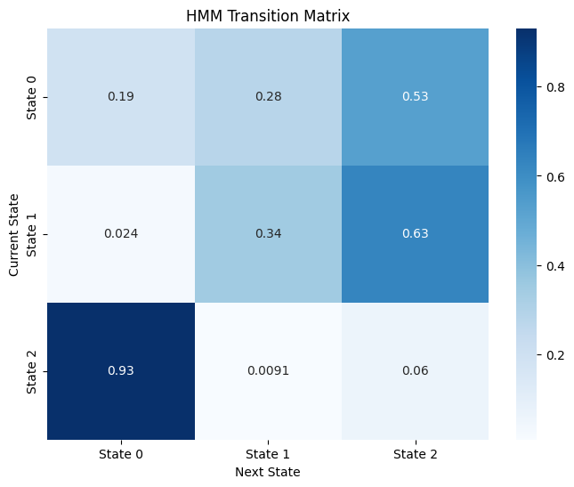
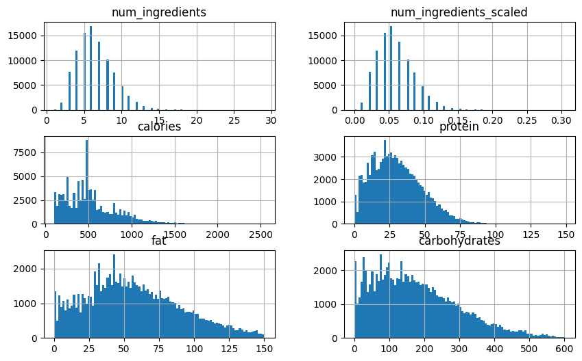

# SmartMealPlanner
- Joseph Whiteman, David Sanchez

## Links to our Milestones: 
- [Milestone 2 Main.ipynb](https://github.com/JosephW23/SmartMealPlanner/blob/Milestone2/Main.ipynb)
- [Milestone 2 Homepage](https://github.com/JosephW23/SmartMealPlanner/tree/Milestone2)
- [Milestone 3 Main.ipynb](https://github.com/JosephW23/SmartMealPlanner/blob/Milestone3/Main.ipynb)
- [Milestone 3 Homepage](https://github.com/JosephW23/SmartMealPlanner/tree/Milestone3)

### Datasets
- **Kaggle RecipeNLG Database**: https://www.kaggle.com/datasets/saldenisov/recipenlg
- **Branded Food Database**: https://fdc.nal.usda.gov/fdc-datasets/FoodData_Central_branded_food_csv_2024-10-31.zip

# Milestone 3: Hidden Markov Model Implementation

## Describe your agent in terms of PEAS and give a background of your task at hand.

**Performance**<br />
Our agent's performance is evaluated based on its ability to classify recipes by an individual's behavioral diet adherence states using a Hidden Markov Model.  These states are labeled as `Healthy`, `Normal`, and `Unhealthy`, wherein we make the reasonable assumption that an individual who adheres to certain recipes should be labeled with a general health category.  These states are stored in `predicted_behavior`.

We evaluate the model as such:

1. HMM Transition Probabilities - We analyze the frequency at which the model transitions between states.
2. State Assignments - We ensure that recipes are meaningfully grouped into their proper categories across `Healthy`, `Normal`, and `Unhealthy`.
3. Baseline Comparison - We categorize bins through simple heuristics of nutritional content using a weighted scoring measure to award the agent based on our definitions of health.

**Environment**<br />
Our agent operates on the RecipeNLG dataset, wherein after Milestone 2 (below), our data consists of the following columns:
- `title`: Recipe names
- `calorie_category`, `protein_category`, `fat_category`, `carb_category`, `ingredient_category`: Nutritional content of recipes by unit
- `satisfaction`, `diet_adherence`: User preferences and observed behavior

Our preprocessing steps include:
1. Transforming categorical bins into interpretable numerical values for our agent
2. Scaling features for efficient data processing using `MinMaxScaler()`
3. Using a weighted `score` to quantify meal quality

**Actuators**<br />
Our agent assigns recipes one of three hidden behavioral dietary states, with the label denoting recipes that such an individual would adhere to eating consistently.

- `Healthy`: A broad generalization of recipes which have high protein, average fats, and low carbs and the "healthy" individual who would consistently adhere to these recipes
- `Normal`: A broad generalization of recipes which have medium protein, average fats, and medium carbs and the "normal" individual who would consistently adhere to these recipes
- `Unhealthy`: A broad generalization of recipes which have low protein, higher fats, and high carbs and the "unhealthy" individual who would consistently adhere to these recipes

These states are inferred using the Hidden Markov Model and are stored in the `adherence` column.

**Sensors**<br />
The Hidden Markov Model takes in:

- Normalized nutritional features: `calorie_category`, `protein_category`, `fat_category`, `carb_category`
- User preference factors: `satisfaction`, `diet_adherence`
- Score: A weighted evaluation based on the relative importance of all six aforementioned factors, which serves as input to our HMM.

## Packages Used

##### `from hmmlearn import hmm`

**Hidden State Learning using a Gaussian Hidden Markov Model**<br />

- `hmm` provides a Gaussian Hidden Markov Model, which is a probabilistic model that assumes hidden states underlie our observed data.
- This Gaussian HMM allows us to model sequential patterns and latent state transitions, which our Bayesian Network was only able to capture static dependencies.
- We initialize our model using three hidden behavioral dietary states: `Healthy`, `Normal`, and `Unhealthy`.

**State Transition Learning**<br />

- `hmm` provides the necessary infrastructure of the Expectation-Maximization algorithm for our Hidden Markov Model to learn a dietary state transition matrix from our observed data.

**Parameter Estimation with Maximum Likelihood**<br />

- Given our calculated weighed scores, our HMM then estimates: (1) initial state probabilities, (2) transition probabilities, and (3) emission probabilities, all using Maximum Likelihood Estimation

**Difference between Conventional HMM and Gaussian HMM**<br />

According to our research, conventional HMMs work with discrete observations, where Gaussian HMMs work with continuous observations; although our original nutritional features, that being `calorie_category`, `protein_category`, etc, were binned into certain numerical categories, these values were later scaled into continuous numerical observations for our Gaussian HMM.  Furthermore, the recipe scoring system and transformed feature values are indeed continuous; as a result, we believe that a Gaussian HMM using `from hmmlearn import hmm` is the correct tool to capture uncertainty in meal classification using our scoring methodology.

## Agent Setup, Data Preprocessing, and Training Setup

The RecipeNLG dataset contains well over one million recipes, but our preprocessing steps throughout Milestone 2 has brought the size down to a manageable size of 100,000 rows; by clearing out null values, removing rows with ambiguous units and/or measurement sizes, we were able to avoid intensive preprocessing for Milestone 3.

#### Milestone 3 Preprocessing

1. Convert categorical bins (e.g. for `calorie_category`, "100-200 kcal") into numeric ranges using our `bin_to_numeric()` function

2. Normalize these features and their numeric ranges using `MinMaxScaler()` 

3. Use our relative weight list to compute a nutritional value score for each recipe, where a higher positive scalar represents higher reward if a higher nutritional value is found in its respective category; negative scalars represent punishment to that nutritional value

> `satisfaction`: 0.25
> `diet_adherence:` 0.30
> `ingredient_category`: 0.20
> `protein_category`: 0.50
> `fat_category`: 0.10
> `carb_category`: -0.50
> `calorie_category`: 0.30

4. Use the score as input for our HMM training

## Training Our Model

We initialize our HMM as such:

```
model = hmm.GaussianHMM(n_components = 3, n_iter = 100, random_state = 101)
model.fit(observations) 
```

1. Parameters: Our HMM is initialized with the assumption of 3 hidden dietary behavioral states, with 100 iterations of its EM algorithm to train the HMM, with a random state seed set to ensure reproducibility of our results

2. Our observations are the scaled scores of our recipes, which our model will train upon

We then assign our hidden states using the labels `Healthy`, `Normal`, and `Unhealthy` using the following:

```
state_means = user_data.groupby("predicted_behavior")["score"].mean().sort_values(ascending=False)
mapping = {state_means.index[0]: "Healthy", state_means.index[1]: "Normal", state_means.index[2]: "Unhealthy"}
user_data["adherence"] = user_data["predicted_behavior"].map(mapping)
```

## Conclusion and Results

**Heatmap of Transition Matrix**<br />

We plot a heatmap to visualize our HMM transition matrix using the following code:

```
trans_mat = model.transmat_

plt.figure(figsize=(8, 6))
sns.heatmap(trans_mat, annot=True, cmap="Blues",
            xticklabels=[f"State {i}" for i in range(trans_mat.shape[1])],
            yticklabels=[f"State {i}" for i in range(trans_mat.shape[0])])
plt.xlabel("Next State")
plt.ylabel("Current State")
plt.title("HMM Transition Matrix")
plt.show()
```



**Findings**<br />

1. State 0 (`Healthy`): 
- 19% chance of remaining in the `Healthy` state
- 28% chance of transitioning to the `Normal` state
- 53% chance of transitioning to the `Unhealthy` state

2. State 1 (`Normal`)
- 2.4% chance of transitioning to the `Healthy` state
- 34% chance of remaining in the `Normal` state
- 63% chance of transitioning to the `Unhealthy` state

3. State 2 (`Unhealthy`)
- 93% chance of transitioning to the `Healthy` state
- <1% chance of transitioning to the `Normal` state
- 6% chance of remaining in the `Unhealthy` state

Clearly, given our recipe dataset and how we've categorized the bins, we were not able to award persistence and discipline as much as we've initially planned in our creation of this project.  Above everything else, we have observed a substantial preference toward major swings to opposite ends of the spectrum: we see a 53% chance of moving from Healthy recipes to Unhealthy recipes, a 63% chance of moving from Normal recipes to Unhealthy recipes, and interestingly enough, an overwhelming **93% chance** of transitioning from Unhealthy recipes to Healthy recipes; such a high probability warrants deep investigation.

**Potential Improvements and Notes**

We may have a misbalanced scoring mechanism, and had we had another Milestone, we would have revisited this mechanism.  It could be argued that we disproportionately reward protein count and underemphasize carbohydrate count, and thus may overemphasize these two features; this could also have contributed to the extreme swings in behavior that the HMM has predicted.

Our binning techniques may have been too broad, despite our best efforts to making more bins in more concentrated areas:



We attempted to bin using these categorizations, and should we have had another Milestone, we would have revisited these bins to see if we could improve upon them.  But we also must prioritize performance of training and the number of bins, as we could oversaturate the model's training with too many bins.

```
calorie_edges = [-np.inf, 150, 300, 450, 600, 750, 1000, 1500, np.inf]
protein_edges = [-np.inf, 5, 10, 15, 20, 30, 40, 50, 75, np.inf]
fat_edges = [-np.inf, 10, 20, 30, 40, 50, 75, 100, np.inf]
carb_edges = [-np.inf, 25, 50, 75, 100, 200, 300, 400, 500, np.inf]
ingredient_edges = [-np.inf, 3, 5, 7, 9, 11, np.inf]
```

The number of assumed latent states (i.e. `Healthy`, `Normal`, and `Unhealthy`) may have been too little.  This may have caused such drastic swings in transition probabilities across these three states to move toward more polarized sides.

As mentioned in Milestone 2, a major limitation of our data preprocessing was the sheer number of rows excluded due to two reasons:

1. Ambiguous recipe measurements in RecipeNLG
2. Broad Regex filtering in Milestone 2 of data

There are simply either too many ambiguous measurements (i.e. "A jar of") and not enough nutritional value matching in our corresponding data sets to ensure a totally accurate representation of the nutritional value of each recipe.  As an example, we observed irregularly high carbohydrate values across `Healthy`, `Normal`, and `Unhealthy`, which is absolutely a result of our preprocessing and handling of edge case values across the RecipeNLG dataset.  This may have also caused such drastic swings in our transition matrix as well.


## Contributions for Milestone 3

### Questions asked ChatGPT

#### 1. "I'm having trouble understanding how to dynamically score our meals since it can be very subjective, given our Milestone 3 objective of using an HMM to analyze meal timing and sequences to predict the best meal schedules based on a mix of performance metrics, i.e. user satisfaction, nutritional accuracy, diet adherence, and the number of ingredients as a proxy for cost efficiency.  And thus, we'll be tracking how meals are scheduled over time and how users respond to those recommendations, then optimize future recommendations based on past behavior.  But I'm having a hard time developing a scoring system, the packages necessary, and the general framework needed for this kind of system.  Do you have any ideas?"

**Response:**  
Below is an overview of one approach to dynamically score meals for your Milestone 3 objectives. This isn’t a fully baked solution—rather, it’s a framework to help you think through how you might combine these subjective metrics into a composite score that can then be used in an HMM.

- **Define Your Key Performance Metrics:**  
  You mentioned four main metrics: ser Satisfaction: (e.g., explicit ratings or implicit signals like repeat selections)

  Nutritional Accuracy: How well does the meal meet nutritional guidelines?

  Diet Adherence: Does the meal align with the user’s meal plan or past behavior?

  Cost Efficiency (Proxy): Fewer ingredients are assumed to be more cost-efficient.

  Because these metrics come from different domains, you’ll want to normalize them so that they can be combined.

- **Normalization & Weighting:**  
  Collect or simulate data for each meal. For example, nutritional accuracy might be calculated by comparing the meal’s macronutrients to a target range.

  Normalize these scores (e.g., using MinMax scaling) so that each metric ranges between 0 and 1.

  Assign weights based on your project priorities. For example, if nutritional accuracy and diet adherence are more important than cost efficiency, you might give them higher weights.

- **Developing a Dynamic Framework:**  
  Your framework could have these components:
  
  Data Collection:
  Gather user feedback (satisfaction) and compute the other metrics from your dataset (nutritional values, ingredient counts). For now, you might simulate satisfaction ratings if real data isn’t available.

  Scoring Module:
  Write a function that takes a meal’s features and returns a composite score based on your weighted formula. Use packages like NumPy and scikit-learn (for normalization).

  Time-Series Component:
  Since you want to analyze sequences, your system should update these scores over time. You could store a rolling average of a user’s satisfaction or adherence for meals in a given time window.

  HMM Integration:
  Feed the sequence of composite scores (or even the vector of individual normalized metrics) into your HMM. The HMM then learns transition probabilities between different “states” of meal quality or adherence. In this way, your HMM isn’t directly scoring meals—it’s learning how a user’s composite meal quality evolves over time, and you can use it to predict future states.

  By relying on your available nutritional values and ingredient lists, you can learn the relationships that drive cost, even without a direct cost API. This approach not only makes use of the data at hand but also provides flexibility to update your model as more cost-related data becomes available.

- **Suggested Packages and Tools:**
  NumPy & Pandas: For data manipulation and numerical calculations.

  Scikit-learn: For normalization (e.g., MinMaxScaler) and possibly clustering to get an initial sense of meal groupings.

  hmmlearn: For the Hidden Markov Model part.

  Matplotlib or Seaborn: For visualizing the distribution of scores and HMM transitions (if needed).

# Milestone 2: Bayesian Network

## Milestone 2 Regrade Updates
### SciPy and pgmpy Usage in Bayesian Network Construction

#### **1. `scipy.stats`**  
The `scipy.stats` module in SciPy is a statistical library that includes functions for probability distributions, statistical tests, and descriptive statistics. It was used in our project to assess data distributions and create probability-based insights that are critical for the Bayesian Network construction.

#### **2. `pgmpy.models import BayesianNetwork`**  
`pgmpy.models.BayesianNetwork` is the fundamental class for building Bayesian Networks. It allows us to create a Directed Acyclic Graph (DAG) in which nodes represent variables and edges represent dependencies. The model structure is enhanced with algorithms such as **Hill Climb Search** and **K2 Score**, which we use in our project.

#### **3. `pgmpy.estimators import MaximumLikelihoodEstimator`**  
This estimator is used to generate **Conditional Probability Tables (CPTs)** for the Bayesian Network. Given the network structure and observed data, `MaximumLikelihoodEstimator` calculates the probability distributions for each node in the DAG based on its parents.

#### **4. `pgmpy.inference import VariableElimination`**  
An inference process called **Variable Elimination** aids in the Bayesian Network's response to probabilistic inquiries. To calculate conditional probabilities, it marginalizes variables that are not important. Given calorie limits, it was utilized in our project to identify the most likely **macronutrient composition category**.

#### **5. `pgmpy.estimators import HillClimbSearch, K2Score`**  
(Needed to fix the horrible structure of the original Bayesian Network, where everything was interdependent—this ensured no directed cycles in the Bayesian Network).  

- **Hill Climb Search (HCS):** A structure-learning method that gradually refines the Bayesian Network by adding, deleting, or reversing edges in order to optimize a score function.  
- **K2 Score:** A scoring function that evaluates the BN structure. It ensures correct DAG generation by eliminating cycles and increasing the likelihood of observed data.

---

### Bayesian Network Structure
#### Nodes
The Bayesian Network consists of the following nodes:

- **`num_ingredients`** – Number of ingredients in a food item  
- **`calorie_category`** – Categorized calorie levels  
- **`protein_category`** – Categorized protein levels  
- **`fat_category`** – Categorized fat levels  
- **`carb_category`** – Categorized carbohydrate levels

#### Directed Edges
- calorie_category → ingredient_category
- protein_category → fat_category
- protein_category → ingredient_category
- protein_category → calorie_category
- fat_category → calorie_category
- fat_category → ingredient_category
- carb_category → protein_category
- carb_category → calorie_category
- carb_category → fat_category
- carb_category → ingredient_category

Since there is no directed cycle in this graph, and thus this graph is a Directed Acyclic Graph, this results in a valid Bayesian Network formation.

#### Generated Diagram:


### Data Preprocessing Overview

#### Dataset Details

- The dataset originates from recipeNLG.csv and USDA nutrient files.
- Irrelevant columns such as link, source, and directions were dropped.
- Ingredients were extracted and cleaned to remove measurement units and amounts.
- A mapping system matched ingredient names to their USDA nutrient profile.

#### Feature Engineering

- num_ingredients: The count of ingredients in a recipe.
- Macronutrients (calories, protein, fat, carbohydrates) were derived from USDA data.
- Categories were created for these features using binning methods:
  - calorie_category: Ranges 0-150 kcal, 150-300 kcal, etc.
  - protein_category: Ranges 0-5 g, 5-10 g, etc.
  - fat_category: Ranges 0-10 g, 10-20 g, etc.
  - carb_category: Ranges 0-25 g, 25-50 g, etc.
 
---

### Machine Learning Estimation Explanation

#### Structure Learning with Hill Climb Search (HCS)

- HCS starts with an empty graph and iteratively adds, removes, or reverses edges.
- The process is guided by the K2Score, which ensures the best-scoring acyclic BN is found.

#### Parameter Learning with Maximum Likelihood Estimation (MLE)
- Once the structure is learned, MaximumLikelihoodEstimator estimates probability distributions for each node given its parent nodes.
- These CPTs allow inference of unknown variables based on evidence.

#### Inference Using Variable Elimination
- Queries were performed to find the most probable macronutrient composition given a specific calorie range.
- Example result: Most probable (Protein, Fat, Carb, Ingredients) recommendation given query 150-300 kcal: Protein = 10-15 g, Fat = 0-10 g, Carbs = 25-50 g, Ingredients = 3-5 (P=0.0172)

## Milestone 2 Original Content

### Explain what your AI agent does in terms of PEAS.  What is the "world" like?
**Performance**<br />
Our agent aims to generate meal recommendations which balance nutritional quality (specifically calories, proteins, fats, and carbohydrates) with recipe simplicity (lower number of ingredients).  The concept of fewer ingredients indirectly and approximately supports our goal of optimizing nutritional meal plans while balancing financial constraints.

**Environment**<br />
The "world" is the recipe domain which contains datasets such as RecipeNLG and USDA FoodData Central, providing ingredients and nutritional facts, respectively.  This world has proven to be extremely ambiguous and uncertain: ingredients, names, and especially that of nutritional facts and costs have varied widely across recipes, and therefore, causing noise in our data.

The environment is yet to include necessary external and additional inputs, such as our goal of incorporating user dietary preferences.  

**Actuators**<br />
This agent and its outputs are its recommended meal plans for the user, acting by suggesting recipes for the user to cook to optimize their nutritional goals.

**Sensors**<br />
The agent is able to sense the world through the ingredients of the Kaggle RecipeNLG dataset and the nutritional data of the USDA FoodData Central dataset.  However, future versions will use user feedback as sensory information.

### What kind of agent is it?  Goal-based?  Utility-based?

The SmartMealPlanner agent is utility-based and aims to balance multiple priorities:

1. Maximizing nutritional quality for the user
2. Lowering the number of ingredients in recipes to reduce complexity and, potentially, financial burden for the user

By considering these factors, the agent utilizes a Bayesian Network to account for uncertainty in ingredient matches and nutritional values.  As a result, our agent's utility-based approach allows it to optimize the balance between nutritional goals and recipe simplicity for the overall benefit of the user.

### Describe how your agent is set up and where it fits in probabilistic modeling.

Our agent's Bayesian Neywork is part of the overall probabilistic modeling process as such:

1. **Data Preprocessing and Feature Engineering:**
- Cleaned RecipeNLG and its content and merging with USDA nutritional data, followed by a calculation of nutritional value per recipe through their combined data.

2. **Discretization**
- We categorized the continuous nutritional values and number of ingredients across recipes into "Low", "Medium" and "High" to ensure its compatability with probabilistic modeling.

3. **Setup**
- Our Bayesian Network is defined wherein the discretized number of ingredients is used as a parent node.  This influences nutritional categories with the aim for our agent to learn the probability distribution over specific calorie categories given a certain number of ingredients.

4. **Probabilistic Inference**

Using MLE, we utilize variable elimination to perform inference, thus predicting the probabilistic distribution of specific nutritional categories given certain evidence about the number of ingredients.  Therefore, we allow the agent to learn and reason about how fewer ingredient recipes can have different and distinct nutritional values.

### Conclusion Section

Our initial and final implementation of the Bayesian Network in Milestone 2 suggests that the number of ingredients in a recipe may be correlated to its nutritional value.  Our findings suggest that recipes with fewer ingredients have a notably higher correlation of being a lower-calorie recipe.

We encountered many engineering issues along the way, most notably that of not being able to find a free open-source API that would help us track prices to ingredients.  As a result, we had to re-engineer most of our project to incorporate the new prioritized balance between lessened ingredient complexity and heightened nutritional value.  

Furthermore, preprocessing and combining the USDA FoodCentral Dataset and the Kaggle RecipeNLG Dataset to incorporate into the Bayesian Network proved to be extremely difficult, especially given their substantial size of ~2GB each.

We can absolutely improve upon our data preprocessing pipeline to make it much more efficient, along with reducing the number of unnecessary columns in our combined and intermediate DataFrames to ensure a decreased burden on our memory usage.  We also noted that there could have been a data preprocessing error by taking the mean of certain nutritional values in the event of duplicate categorizations; this may have resulted in rounding errors as exact values would have been more preferable.  We must find a way to be more precise and accurate about this data in a future Milestone.

### Collaboration

Our first plan was to use an ingredient price API, but further working on the project revealed that we faced a massive paywall and were not able to navigate around it.  Thus, we consulted _ChatGPT_ on how to change our plans from using a Bayesian Network to balance high nutritional content and least financial burden to a consideration of high nutritional content and _lessened ingredient complexity_.  

### Questions Asked ChatGPT

#### 1. "We're developing a Bayesian Network based on nutrition and cost, but we do not have a free-to-use ingredient cost API. What is another way we can build a Bayesian Network using recipe data? We have access to certain nutritional values, ingredient lists, and their respective recipes."

**Response:**  
You can sidestep the need for a cost API by leveraging the recipe data you already have to infer cost estimates indirectly. Here are a few approaches:

- **Latent Variable Modeling:**  
  Treat cost as a latent (hidden) variable in your Bayesian Network. If you have any recipes where total cost is known (even if it's just a few examples), you can use those to learn the relationships between ingredient presence, nutritional values, and overall cost. Once the network is trained, it can estimate cost for new recipes based solely on their ingredients and nutritional profiles.

- **Proxy Cost Estimation:**  
  Instead of direct cost data, you might assign proxy cost values to ingredients based on factors like market availability, rarity, or even typical quantities used in recipes. You can then build your network where these proxies contribute to the overall recipe cost. Over time, you can refine these proxies by comparing against any known cost benchmarks or aggregated pricing data you might find from other sources (like grocery store reports or market research).

- **Data-Driven Cost Inference:**  
  If you have a large dataset of recipes, you can use statistical techniques (e.g., regression analysis) to correlate certain nutritional or ingredient features with estimated cost. For instance, recipes that include certain ingredients might, on average, be more expensive. These correlations can then be encoded as conditional probabilities within your Bayesian Network.

By relying on your available nutritional values and ingredient lists, you can learn the relationships that drive cost, even without a direct cost API. This approach not only makes use of the data at hand but also provides flexibility to update your model as more cost-related data becomes available.

---

#### 2. "Is the proxy of balancing the number of ingredients and substituting our loss of financial cost as a balancing factor a reasonable idea?"

**Response:**  
Using the number of ingredients as a proxy can be a reasonable starting point, especially if you lack direct financial data. However, there are some important considerations:

- **Correlation vs. Causation:**  
  The number of ingredients might correlate with cost (e.g., more ingredients can mean higher cost), but this isn't always the case. A recipe with fewer, high-cost ingredients might be more expensive than one with many low-cost ingredients.

- **Ingredient Variability:**  
  Not all ingredients have the same cost impact. You might consider weighting ingredients differently if you have some data on their typical cost ranges or nutritional value correlations.

- **Model Flexibility:**  
  Treating cost as a latent or proxy variable is a valid approach in a Bayesian Network. As you collect more data or refine your proxies, you can update the network to reflect a more nuanced view of cost.

**Summary:**  
Balancing the number of ingredients as a proxy for financial cost is a reasonable idea as long as you're aware of its limitations and are open to refining your approach with additional data or weighting factors when possible.
