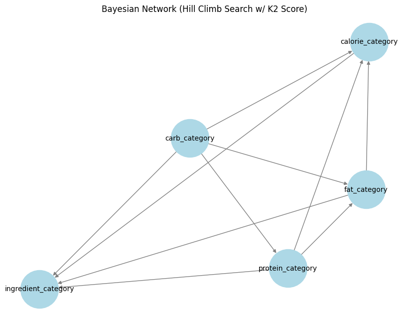

# SmartMealPlanner
- Joseph Whiteman, David Sanchez

## Links to our Milestones: 
- [Milestone 2 Main.ipynb](https://github.com/JosephW23/SmartMealPlanner/blob/Milestone2/Main.ipynb)
- [Milestone 2 Homepage](https://github.com/JosephW23/SmartMealPlanner/tree/Milestone2)

### Datasets
- **Kaggle RecipeNLG Database**: https://www.kaggle.com/datasets/saldenisov/recipenlg
- **Branded Food Database**: https://fdc.nal.usda.gov/fdc-datasets/FoodData_Central_branded_food_csv_2024-10-31.zip

# Milestone 2

## Milestone 2 Regrade Updates
### SciPy and pgmpy Usage in Bayesian Network Construction

#### **1. `scipy.stats`**  
The `scipy.stats` module in SciPy is a statistical library that includes functions for probability distributions, statistical tests, and descriptive statistics. It was used in our project to assess data distributions and create probability-based insights that are critical for the Bayesian Network construction.

#### **2. `pgmpy.models import BayesianNetwork`**  
`pgmpy.models.BayesianNetwork` is the fundamental class for building Bayesian Networks. It allows us to create a Directed Acyclic Graph (DAG) in which nodes represent variables and edges represent dependencies. The model structure is enhanced with algorithms such as **Hill Climb Search** and **K2 Score**, which we use in our project.

#### **3. `pgmpy.estimators import MaximumLikelihoodEstimator`**  
This estimator is used to generate **Conditional Probability Tables (CPTs)** for the Bayesian Network. Given the network structure and observed data, `MaximumLikelihoodEstimator` calculates the probability distributions for each node in the DAG based on its parents.

#### **4. `pgmpy.inference import VariableElimination`**  
An inference process called **Variable Elimination** aids in the Bayesian Network's response to probabilistic inquiries. To calculate conditional probabilities, it marginalizes variables that are not important. Given calorie limits, it was utilized in our project to identify the most likely **macronutrient composition category**.

#### **5. `pgmpy.estimators import HillClimbSearch, K2Score`**  
(Needed to fix the horrible structure of the original Bayesian Network, where everything was interdependent—this ensured no directed cycles in the Bayesian Network).  

- **Hill Climb Search (HCS):** A structure-learning method that gradually refines the Bayesian Network by adding, deleting, or reversing edges in order to optimize a score function.  
- **K2 Score:** A scoring function that evaluates the BN structure. It ensures correct DAG generation by eliminating cycles and increasing the likelihood of observed data.

---

### Bayesian Network Structure
#### Nodes
The Bayesian Network consists of the following nodes:

- **`num_ingredients`** – Number of ingredients in a food item  
- **`calorie_category`** – Categorized calorie levels  
- **`protein_category`** – Categorized protein levels  
- **`fat_category`** – Categorized fat levels  
- **`carb_category`** – Categorized carbohydrate levels

#### Directed Edges
- calorie_category → ingredient_category
- protein_category → fat_category
- protein_category → ingredient_category
- protein_category → calorie_category
- fat_category → calorie_category
- fat_category → ingredient_category
- carb_category → protein_category
- carb_category → calorie_category
- carb_category → fat_category
- carb_category → ingredient_category

Since there is no directed cycle in this graph, and thus this graph is a Directed Acyclic Graph, this results in a valid Bayesian Network formation.

#### Generated Diagram:

### Data Preprocessing Overview

#### Dataset Details

- The dataset originates from recipeNLG.csv and USDA nutrient files.
- Irrelevant columns such as link, source, and directions were dropped.
- Ingredients were extracted and cleaned to remove measurement units and amounts.
- A mapping system matched ingredient names to their USDA nutrient profile.

#### Feature Engineering

- num_ingredients: The count of ingredients in a recipe.
- Macronutrients (calories, protein, fat, carbohydrates) were derived from USDA data.
- Categories were created for these features using binning methods:
  - calorie_category: Ranges 0-150 kcal, 150-300 kcal, etc.
  - protein_category: Ranges 0-5 g, 5-10 g, etc.
  - fat_category: Ranges 0-10 g, 10-20 g, etc.
  - carb_category: Ranges 0-25 g, 25-50 g, etc.
 
---

### Machine Learning Estimation Explanation

#### Structure Learning with Hill Climb Search (HCS)

- HCS starts with an empty graph and iteratively adds, removes, or reverses edges.
- The process is guided by the K2Score, which ensures the best-scoring acyclic BN is found.

#### Parameter Learning with Maximum Likelihood Estimation (MLE)
- Once the structure is learned, MaximumLikelihoodEstimator estimates probability distributions for each node given its parent nodes.
- These CPTs allow inference of unknown variables based on evidence.

#### Inference Using Variable Elimination
- Queries were performed to find the most probable macronutrient composition given a specific calorie range.
- Example result: Most probable (Protein, Fat, Carb, Ingredients) recommendation given query 150-300 kcal: Protein = 10-15 g, Fat = 0-10 g, Carbs = 25-50 g, Ingredients = 3-5 (P=0.0172)

## Milestone 2 Original Content

### Explain what your AI agent does in terms of PEAS.  What is the "world" like?
**Performance** 
Our agent aims to generate meal recommendations which balance nutritional quality (specifically calories, proteins, fats, and carbohydrates) with recipe simplicity (lower number of ingredients).  The concept of fewer ingredients indirectly and approximately supports our goal of optimizing nutritional meal plans while balancing financial constraints.

**Environment** 
The "world" is the recipe domain which contains datasets such as RecipeNLG and USDA FoodData Central, providing ingredients and nutritional facts, respectively.  This world has proven to be extremely ambiguous and uncertain: ingredients, names, and especially that of nutritional facts and costs have varied widely across recipes, and therefore, causing noise in our data.

The environment is yet to include necessary external and additional inputs, such as our goal of incorporating user dietary preferences.  

**Actuators** 
This agent and its outputs are its recommended meal plans for the user, acting by suggesting recipes for the user to cook to optimize their nutritional goals.

**Sensors** 
The agent is able to sense the world through the ingredients of the Kaggle RecipeNLG dataset and the nutritional data of the USDA FoodData Central dataset.  However, future versions will use user feedback as sensory information.

### What kind of agent is it?  Goal-based?  Utility-based?

The SmartMealPlanner agent is utility-based and aims to balance multiple priorities:

1. Maximizing nutritional quality for the user
2. Lowering the number of ingredients in recipes to reduce complexity and, potentially, financial burden for the user

By considering these factors, the agent utilizes a Bayesian Network to account for uncertainty in ingredient matches and nutritional values.  As a result, our agent's utility-based approach allows it to optimize the balance between nutritional goals and recipe simplicity for the overall benefit of the user.

### Describe how your agent is set up and where it fits in probabilistic modeling.

Our agent's Bayesian Neywork is part of the overall probabilistic modeling process as such:

1. **Data Preprocessing and Feature Engineering:**
- Cleaned RecipeNLG and its content and merging with USDA nutritional data, followed by a calculation of nutritional value per recipe through their combined data.

2. **Discretization**
- We categorized the continuous nutritional values and number of ingredients across recipes into "Low", "Medium" and "High" to ensure its compatability with probabilistic modeling.

3. **Setup**
- Our Bayesian Network is defined wherein the discretized number of ingredients is used as a parent node.  This influences nutritional categories with the aim for our agent to learn the probability distribution over specific calorie categories given a certain number of ingredients.

4. **Probabilistic Inference**

Using MLE, we utilize variable elimination to perform inference, thus predicting the probabilistic distribution of specific nutritional categories given certain evidence about the number of ingredients.  Therefore, we allow the agent to learn and reason about how fewer ingredient recipes can have different and distinct nutritional values.

### Conclusion Section

Our initial and final implementation of the Bayesian Network in Milestone 2 suggests that the number of ingredients in a recipe may be correlated to its nutritional value.  Our findings suggest that recipes with fewer ingredients have a notably higher correlation of being a lower-calorie recipe.

We encountered many engineering issues along the way, most notably that of not being able to find a free open-source API that would help us track prices to ingredients.  As a result, we had to re-engineer most of our project to incorporate the new prioritized balance between lessened ingredient complexity and heightened nutritional value.  

Furthermore, preprocessing and combining the USDA FoodCentral Dataset and the Kaggle RecipeNLG Dataset to incorporate into the Bayesian Network proved to be extremely difficult, especially given their substantial size of ~2GB each.

We can absolutely improve upon our data preprocessing pipeline to make it much more efficient, along with reducing the number of unnecessary columns in our combined and intermediate DataFrames to ensure a decreased burden on our memory usage.  We also noted that there could have been a data preprocessing error by taking the mean of certain nutritional values in the event of duplicate categorizations; this may have resulted in rounding errors as exact values would have been more preferable.  We must find a way to be more precise and accurate about this data in a future Milestone.

### Collaboration

Our first plan was to use an ingredient price API, but further working on the project revealed that we faced a massive paywall and were not able to navigate around it.  Thus, we consulted _ChatGPT_ on how to change our plans from using a Bayesian Network to balance high nutritional content and least financial burden to a consideration of high nutritional content and _lessened ingredient complexity_.  

### Questions Asked ChatGPT

#### 1. "We're developing a Bayesian Network based on nutrition and cost, but we do not have a free-to-use ingredient cost API. What is another way we can build a Bayesian Network using recipe data? We have access to certain nutritional values, ingredient lists, and their respective recipes."

**Response:**  
You can sidestep the need for a cost API by leveraging the recipe data you already have to infer cost estimates indirectly. Here are a few approaches:

- **Latent Variable Modeling:**  
  Treat cost as a latent (hidden) variable in your Bayesian Network. If you have any recipes where total cost is known (even if it's just a few examples), you can use those to learn the relationships between ingredient presence, nutritional values, and overall cost. Once the network is trained, it can estimate cost for new recipes based solely on their ingredients and nutritional profiles.

- **Proxy Cost Estimation:**  
  Instead of direct cost data, you might assign proxy cost values to ingredients based on factors like market availability, rarity, or even typical quantities used in recipes. You can then build your network where these proxies contribute to the overall recipe cost. Over time, you can refine these proxies by comparing against any known cost benchmarks or aggregated pricing data you might find from other sources (like grocery store reports or market research).

- **Data-Driven Cost Inference:**  
  If you have a large dataset of recipes, you can use statistical techniques (e.g., regression analysis) to correlate certain nutritional or ingredient features with estimated cost. For instance, recipes that include certain ingredients might, on average, be more expensive. These correlations can then be encoded as conditional probabilities within your Bayesian Network.

By relying on your available nutritional values and ingredient lists, you can learn the relationships that drive cost, even without a direct cost API. This approach not only makes use of the data at hand but also provides flexibility to update your model as more cost-related data becomes available.

---

#### 2. "Is the proxy of balancing the number of ingredients and substituting our loss of financial cost as a balancing factor a reasonable idea?"

**Response:**  
Using the number of ingredients as a proxy can be a reasonable starting point, especially if you lack direct financial data. However, there are some important considerations:

- **Correlation vs. Causation:**  
  The number of ingredients might correlate with cost (e.g., more ingredients can mean higher cost), but this isn't always the case. A recipe with fewer, high-cost ingredients might be more expensive than one with many low-cost ingredients.

- **Ingredient Variability:**  
  Not all ingredients have the same cost impact. You might consider weighting ingredients differently if you have some data on their typical cost ranges or nutritional value correlations.

- **Model Flexibility:**  
  Treating cost as a latent or proxy variable is a valid approach in a Bayesian Network. As you collect more data or refine your proxies, you can update the network to reflect a more nuanced view of cost.

**Summary:**  
Balancing the number of ingredients as a proxy for financial cost is a reasonable idea as long as you're aware of its limitations and are open to refining your approach with additional data or weighting factors when possible.
